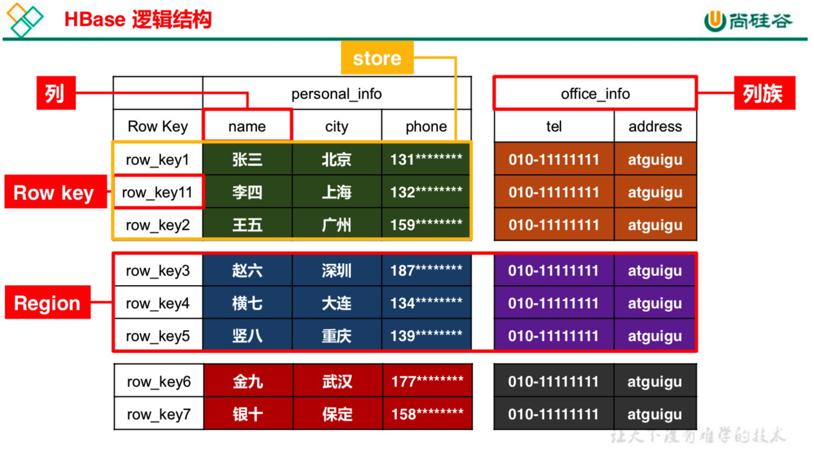
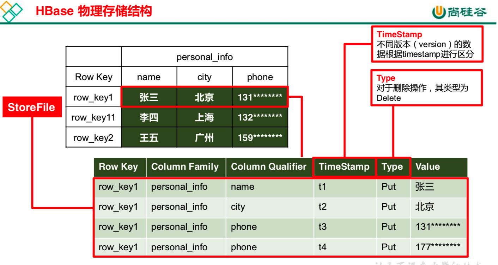
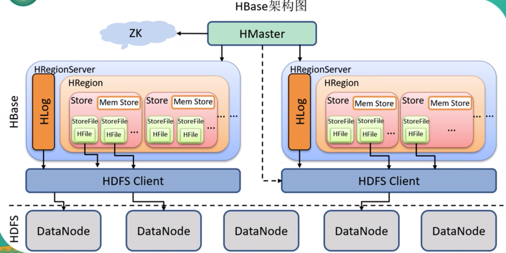
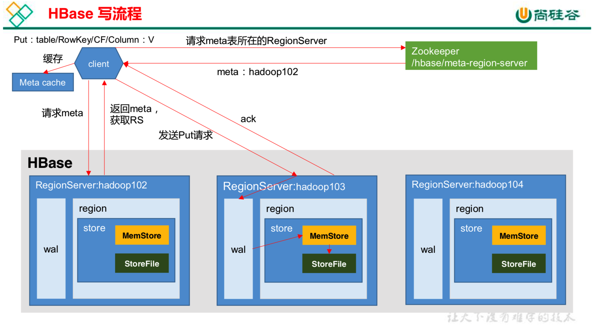
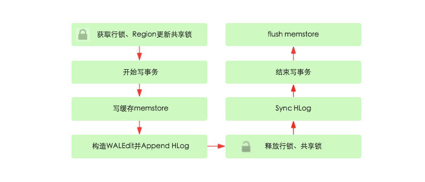
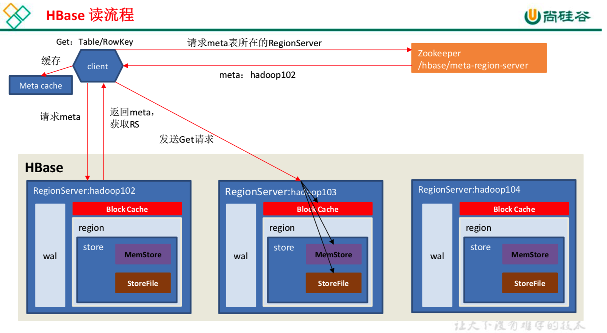
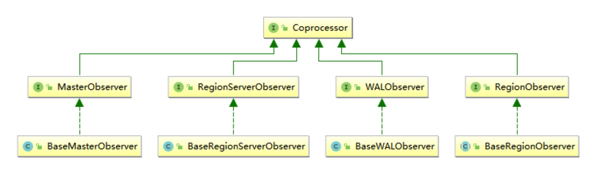
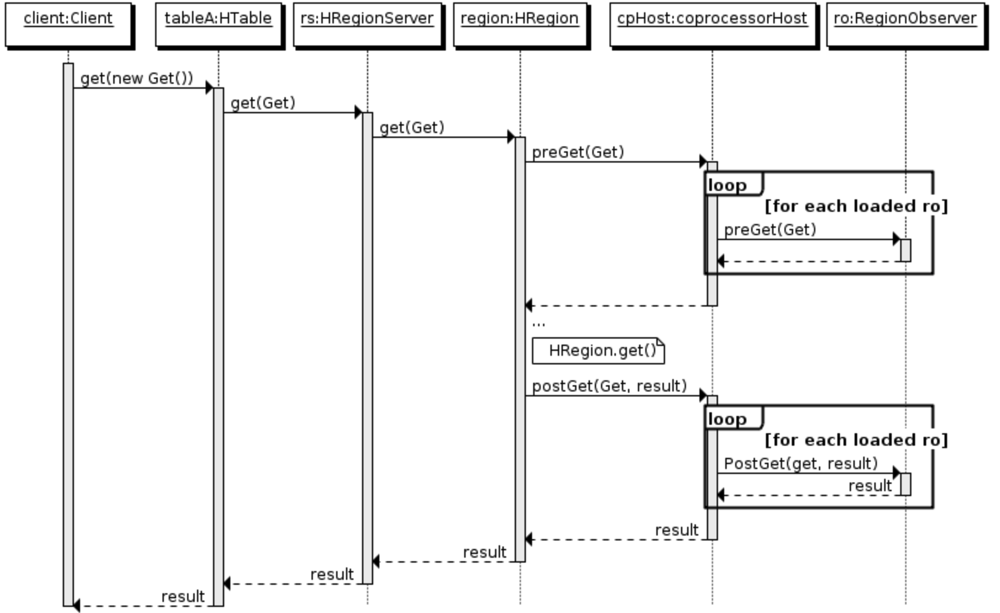

# HBASE
1. [HBase概述](#HBase概述)
2. [HBase数据模型](#HBase数据模型)
3. [HBase架构](#HBase架构)
4. [HBase写流程](#HBase写流程)
5. [HBase读流程](#HBase读流程)
6. [Region和Master补充](#Region和Master补充)
    + [Region分配](#Region分配)
    + [Region-Split](#Region-Split)
    + [RegionServer上线](#RegionServer上线)
    + [RegionServer下线](#RegionServer下线)
    + [Master上线](#Master上线)
    + [Master下线](#Master下线)
7. [协处理器](#协处理器)
    + [起源](#起源)
    + [协处理器类型](#协处理器类型)

## HBase概述
HBase 是一种分布式、可扩展、支持海量数据存储的 NoSQL 数据库。

逻辑上，HBase 的数据模型同关系型数据库很类似，数据存储在一张表中，有行有列。但从 HBase 的底层物理存储结构(K-V)来看，
HBase 更像是一个 multi-dimensional map。

## HBase数据模型
**HBase 逻辑结构**  
  

**HBase 物理存储结构**  

**数据模型**
1. NameSpace  
命名空间，类似于关系型数据库的 DataBase 概念，每个命名空间下有多个表。HBase 有两个自带的命名空间，分别是 hbase 和 default，
hbase 中存放的是 HBase 内置的表， default 表是用户默认使用的命名空间。

2. Region  
类似于关系型数据库的表概念。不同的是，HBase 定义表时只需要声明列族即可，不需要声明具体的列。这意味着，往 HBase 写入数据时，
字段可以动态、按需指定。因此，和关系型数据库相比，HBase 能够轻松应对字段变更的场景。

3. Row  
HBase 表中的每行数据都由一个 RowKey 和多个 Column(列)组成，数据是按照 RowKey 的字典顺序存储的，
并且查询数据时只能根据 RowKey 进行检索，所以 RowKey 的设计十分重要。RowKey 可以是任意字符串(最大长度是 64KB，实际应用中长度一般为 10-100bytes)，
在 hbase 内部，RowKey 保存为字节数组。
>访问hbase table中的行，只有三种方式：
>1. 通过单个row key访问；
>2. 通过row key的range；
>3. 全表扫描。

4. Column  
HBase 中的每个列都由 Column Family(列族)和 Column Qualifier(列限定符)进行限 定，例如 info:name，info:age。建表时，
只需指明列族，而列限定符无需预先定义。
 
5. Time Stamp  
用于标识数据的不同版本(version)，每条数据写入时，如果不指定时间戳，系统会自动为其加上该字段，其值为写入 HBase 的时间。  
HBase 中通过 row 和 columns 确定的为一个存贮单元称为 cell。每个 cell 都保存着同一份数据的多个版本，版本通过时间戳来索引；
时间戳的类型是 64 位整型。时间戳可以由 hbase(在数据写入时自动)赋值，此时时间戳是精确到毫秒的当前系统时间。时间戳也可以由客户显式赋值。
如果应用程序要避免数据版本冲突，就必须自己生成具有唯一性的时间戳。每个 cell 中，不同版本的数据按照时间倒序排序，即最新的数据排在最前面。
>cell  
>由{row key, column(=<family> + <label>), version} 唯一确定的单元。cell 中的数据是没有类型的，全部是字节码形式存贮。
>插入数据的时候不指定 时间戳 用的是 HBase 服务端的时间戳！服务端的时间戳！服务端的时间戳！在写代码时 sleep 是没用的！

## HBase架构
HBase架构图：  

**角色说明**

1. Region Server  
Region Server 是 Region 的管理者，其实现类为 HRegionServer，是真正的“干活”的节点，主要作用如下:   
对于数据的操作:get, put, delete；  
对于 Region 的操作:splitRegion、compactRegion。

2. Master  
Master 是所有 Region Server 的管理者，其实现类为 HMaster，主要作用如下: 
对于表的操作:create, delete, alter；  
对于 RegionServer 的操作:分配 regions 到每个 RegionServer，监控每个 RegionServer 的状态，负载均衡和故障转移。

3. Zookeeper  
HBase 通过 Zookeeper 来做 Master 的高可用（保证任何时候，集群中只有一个master）、RegionServer 的监控、
元数据（存储 Hbase 的 schema,包括有哪些 table，每个 table 有哪些 column family）的入口以及集群配置的维护等工作。

4. HDFS  
HDFS 为 HBase 提供最终的底层数据存储服务，同时为 HBase 提供高可用的支持。

5. StoreFile  
保存实际数据的物理文件，StoreFile 以 HFile 的形式存储在 HDFS 上。每个 Store 会有一个或多个 StoreFile(HFile)，
数据在每个 StoreFile 中都是有序的。

6. MemStore  
写缓存，由于 HFile 中的数据要求是有序的，所以数据是先存储在 MemStore 中，排好序后，等到达刷写时机才会刷写到 HFile，
每次刷写都会形成一个新的 HFile。

7. HLog(WAL log)  
由于数据要经 MemStore 排序后才能刷写到 HFile，但把数据保存在内存中会有很高的 概率导致数据丢失，为了解决这个问题，
数据会先写在一个叫做 Write-Ahead logfile 的文件中，然后再写入 MemStore 中。所以在系统出现故障的时候，数据可以通过这个日志文件重建。

8. Client  
包含访问 hbase 的接口，client 维护着一些 cache 来加快对 hbase 的访问，比如 Region 的位置信息。
>client 访问 hbase 上数据的过程并不需要 master 参与（寻址访问 zookeeper 和 region server，数据读写访问 regione server），
>master 仅仅维护着 table 和 region 的元数据信息，负载很低。

## HBase写流程

1. Client 先访问 zookeeper，获取 hbase:meta 表位于哪个 Region Server；
2. 访问对应的 Region Server，获取 hbase:meta 表，根据读请求的 namespace:table/rowkey， 
查询出目标数据位于哪个 RegionServer 中的哪个 Region 中，
并将该 table 的 region 信息以及 meta 表的位置信息缓存在客户端的 meta cache，方便下次访问；
3. 与目标 RegionServer 进行通讯；
4. 将数据顺序写入(追加)到 WAL；
5. 将数据写入对应的 MemStore，数据会在 MemStore 进行排序;
6. 向客户端发送 ack;
7. 等达到 MemStore 的刷写时机后，将数据刷写到 HFile。

**一些细节**  
1. HBase 默认设置 autoflush=true，表示put请求直接会提交给服务器进行处理；用户可以设置 autoflush=false，
这样的话 put 请求会首先放到本地 buffer，等到本地 buffer 大小超过一定阈值（默认为2M，可以通过配置文件配置）之后才会提交。
设置为 false 可以极大地提升写入性能，但是因为没有保护机制，如果客户端崩溃的话会导致提交的请求丢失。

2. 服务器端 RegionServer 接收到客户端的写入请求后，首先会反序列化为 Put 对象，然后执行各种检查操作，比如检查region是否是只读、
memstore 大小是否超过 blockingMemstoreSize 等。检查完成之后，就会执行如下核心操作：
  
   1. 获取行锁、Region更新共享锁： HBase中使用行锁保证对同一行数据的更新都是互斥操作，用以保证更新的原子性；
   2. 开始写事务：获取 write number，用于实现 MVCC(多版本控制，MySQL 中的一个道理)，实现数据的非锁定读，在保证读写一致性的前提下提高读取性能；
   3. 写缓存 memstore：HBase并不会直接将数据落盘，而是先写入缓存，等缓存满足一定大小之后再一起落盘；
   4. Append HLog：该步骤就是将数据构造为 WALEdit 对象，然后顺序写入 HLog 中；
   5. 释放行锁以及共享锁；
   6. Sync HLog：HLog 真正 sync 到 HDFS，在释放行锁之后执行 sync 操作是为了尽量减少持锁时间，提升写性能。如果Sync失败，
   执行回滚操作将 memstore 中已经写入的数据移除；
   7. 结束写事务：此时该线程的更新操作才会对其他读请求可见，更新才实际生效；
   8. flush memstore：当写缓存满64M之后，会启动flush线程将数据刷新到硬盘。

**MemStore Flush 数据刷写**  
 
 
MemStore 刷写时机：  
1. **MemStore 占用的内存超过相关阈值**  
- 如果某个 memstroe 的大小达到了一定的阈值(默认值 128M)，其所在 region 的所有 memstore 都会刷写；每次调用 put、delete 都会去检查这个值。
- 如果数据增加的很快，某个 memstore 的大小达到了  
hbase.hregion.memstore.flush.size(默认值 128M) × hbase.hregion.memstore.block.multiplier(默认值 4)  
（即文件刷写阈值的4倍）
时，除了触发 MemStore 的 flush 操作外，还会**阻塞所有写入**该 Store 的写操作；

2. **RegionServer 中 MemStore 占用内存总和大于相关阈值**  
当 region server 中 memstore 的**总大小**达到  
java_heapsize × hbase.regionserver.global.memstore.size(默认值 0.4) × hbase.regionserver.global.memstore.size.lower.limit(默认值 0.95)  
region 会按照其所有 memstore 的大小顺序(由大到小)依次进行刷写，直到 region server中所有 memstore 的总大小减小到上述值以下；
当 region server 中 memstore 的总大小达到 java_heapsize*hbase.regionserver.global.memstore.size(默认值 0.4) 时，
会阻止继续往所有的 memstore 写操作；

3. **定期自动刷写**  
到达自动刷写的时间，也会触发 memstore flush。自动刷新的时间间隔默认 1 小时；RegionServer 启动的时候会启动一个线程 PeriodicMemStoreFlusher，
每隔一段时间去检查这个 Regionerver 的 Region 有没有超过一定的时间没有刷写；

4. **WAL数量大于相关阈值**  
如果某个 Region 更新的很频繁，既没有达到自动刷写阈值，也没有达到内存限制，但是内存中更新的数量已经很多了，
WAL 文件的数量超过某个阈值（默认为30000000），那么也是会触发刷写的；

5. **手动触发刷写**

## HBase读流程

1. Client 先访问 zookeeper，获取 hbase:meta 表位于哪个 Region Server；
2. 访问对应的 Region Server，获取 hbase:meta 表，根据读请求的 namespace:table/rowkey，
查询出目标数据位于哪个 Region Server 中的哪个 Region 中。并将该 table 的 region 信息以 及 meta 表的位置信息缓存在客户端的 meta cache，
方便下次访问；
3. 与目标 Region Server 进行通讯；
4. 分别在 Block Cache(读缓存)，MemStore 和 Store File(HFile)中查询目标数据，并将查到的所有数据进行合并。
此处所有数据是指同一条数据的不同版本(time stamp)或者不同的类型(Put/Delete)；
5. 将从文件中查询到的数据块(Block，HFile 数据存储单元，默认大小为 64KB)缓存到 Block Cache；
6. 将合并后的最终结果返回给客户端。

**StoreFile Compaction文件合并**  
为啥要合并？  
由于 memstore 每次刷写都会生成一个新的 HFile，且同一个字段的不同版本(timestamp) 和不同类型(Put/Delete)有可能会分布在不同的 HFile 中，
因此查询时需要遍历所有的 HFile。**为了减少 HFile 的个数，以及清理掉过期和删除的数据**，会进行 StoreFile Compaction。

Compaction 分为两种，分别是 Minor Compaction 和 Major Compaction。
- Minor Compaction 会将临近的若干个较小的 HFile 合并成一个较大的 HFile，但不会清理过期和删除的数据；
- Major Compaction 会将一个 Store 下的所有的 HFile 合并成一个大 HFile，并且会清理掉过期和删除的数据。

## Region和Master补充

### Region分配
任何时刻，一个 region 只能分配给一个region server。master 记录了当前有哪些可用的 region server，
以及当前哪些 region 分配给了哪些 region server。当存在未分配的 region，并且有一个 region server 上有可用空间时，
master 就给这个 region server 发送一个装载请求，把 region 分配给这个 region server。region server 得到请求后，
就开始对此 region 提供服务。

### Region-Split
默认情况下，每个 Table 起初只有一个 Region，随着数据的不断写入，Region 会自动进 行拆分。刚拆分时，
两个子 Region 都位于当前的 Region Server，但处于负载均衡的考虑， HMaster 有可能会将某个 Region 转移给其他的 Region Server。

**Region Split 时机**：  
当 1 个 region 中的某个 Store 下所有 StoreFile 的总大小超过 Min(R^2 * "hbase.hregion.memstore.flush.size",hbase.hregion.max.filesize")，
该 Region 就会进行拆分，其中 R 为当前 Region Server 中属于该 Table 的个数(0.94 版本之后)。

### RegionServer上线
master 使用 zookeeper 来跟踪 region server 状态。当某个 region server 启动时，
会首先在 zookeeper 上的 server 目录下建立代表自己的文件，并获得该文件的独占锁。由于 master 订阅了 server 目录上的变更消息，
当 server 目录下的文件出现新增或删除操作时，master 可以得到来自 zookeeper 的实时通知。因此一旦 region server 上线，
master能马上得到消息。

### RegionServer下线
当 region server 下线时，它和 zookeeper 的会话断开，zookeeper 而自动释放代表这台 server 的文件上的独占锁。
而 master 不断轮询 server 目录下文件的锁状态。如果 master 发现某个 region server 丢失了它自己的独占锁，
(或者 master 连续几次和 region server 通信都无法成功)，master 就是尝试去获取代表这个 region server 的读写锁，
一旦获取成功，就可以确定：  
- region server和zookeeper之间的网络断开了；
- region server挂了。

此时 master 会删除 server 目录下代表这台 region server 的文件，并将这台 region server 的 region 分配给其它还活着的同志。

如果网络短暂出现问题导致 region server 丢失了它的锁，那么 region server 重新连接到 zookeeper 之后，只要代表它的文件还在，
它就会不断尝试获取这个文件上的锁，一旦获取到了，就可以继续提供服务。

### Master上线
master 启动进行以下步骤:
1. 从 zookeeper 上获取唯一一个代码 master 的锁，用来阻止其它 master 成为 master；
2. 扫描 zookeeper 上的 server 目录，获得当前可用的 region server 列表；
3. 和 2 中的每个 region server 通信，获得当前已分配的 region 和 region server 的对应关系；
4. 扫描 .META.region 的集合，计算得到当前还未分配的 region，将他们放入待分配 region 列表。

### Master下线
由于 master 只维护表和 region 的元数据，而不参与表数据 IO 的过程，master 下线仅导致所有元数据的修改被冻结(无法创建删除表，
无法修改表的 schema，无法进行 region 的负载均衡，无法处理 region 上下线，无法进行 region 的合并，
唯一例外的是 region 的 split 可以正常进行，因为只有 region server 参与)，表的数据读写还可以正常进行。
因此 master 下线短时间内对整个 hbase 集群没有影响。
从上线过程可以看到，master 保存的信息全是可以冗余信息（都可以从系统其它地方收集到或者计算出来），因此，
一般 hbase 集群中总是有一个 master 在提供服务，还有一个以上的’master’在等待时机抢占它的位置。

## 协处理器

### 起源
在使用 HBase 时，如果你的数据量达到了数十亿行或数百万列，此时能否在查询中返回大量数据将受制于网络的带宽，即便网络状况允许，
但是客户端的计算处理也未必能够满足要求。在这种情况下，协处理器（Coprocessors）应运而生。
它允许你将业务计算代码放入在 RegionServer 的协处理器中，将处理好的数据再返回给客户端，这可以极大地降低需要传输的数据量，
从而获得性能上的提升。同时协处理器也允许用户扩展实现 HBase 目前所不具备的功能，如权限校验、二级索引、完整性约束等。

### 协处理器类型
**Observer协处理器**  
1. 功能  
Observer(观察者) 协处理器类似于关系型数据库中的触发器，当发生某些事件的时候这类协处理器会被 Server 端调用。通常可以用来实现下面功能：
- 权限校验：在执行 Get 或 Put 操作之前，您可以使用 preGet 或 prePut 方法检查权限；
- 完整性约束：HBase 不支持关系型数据库中的外键功能，可以通过触发器在插入或者删除数据的时候，对关联的数据进行检查；
- 二级索引：可以使用协处理器来维护二级索引。

2. 类型  
当前 Observer 协处理器有以下四种类型：
- RegionObserver : 允许观察 Region 上的事件，例如 Get 和 Put 操作；
- RegionServerObserver : 允许观察与 RegionServer 操作相关的事件，例如启动，停止或执行合并，提交或回滚；
- MasterObserver : 允许观察与 HBase Master 相关的事件，例如表创建，删除或 schema 修改；
- WalObserver : 允许观察与预写日志（WAL）相关的事件。

3. 接口  
以上四种类型的 Observer 协处理器均继承自 Coprocessor 接口，这四个接口中分别定义了所有可用的钩子方法，
以便在对应方法前后执行特定的操作。通常情况下，我们并不会直接实现上面接口，而是继承其 Base 实现类，
Base 实现类只是简单空实现了接口中的方法，这样我们在实现自定义的协处理器时，就不必实现所有方法，只需要重写必要方法即可。

4. 执行流程  

- 客户端发出 put 请求；
- 该请求被分派给合适的 RegionServer 和 region；
- coprocessorHost 拦截该请求，然后在该表的每个 RegionObserver 上调用 prePut()；
- 如果没有被 prePut() 拦截，该请求继续送到 region，然后进行处理；
- region 产生的结果再次被 CoprocessorHost 拦截，调用 postPut()；
- 假如没有 postPut() 拦截该响应，最终结果被返回给客户端。

**Endpoint协处理器**  
Endpoint 协处理器类似于关系型数据库中的存储过程。客户端可以调用 Endpoint 协处理器在服务端对数据进行处理，然后再返回。

以聚集操作为例，如果没有协处理器，当用户需要找出一张表中的最大数据，即 max 聚合操作，就必须进行全表扫描，然后在客户端上遍历扫描结果，
这必然会加重了客户端处理数据的压力。利用 Coprocessor，用户可以将求最大值的代码部署到 HBase Server 端，H
Base 将利用底层 cluster 的多个节点并发执行求最大值的操作。即在每个 Region 范围内执行求最大值的代码，
将每个 Region 的最大值在 Region Server 端计算出来，仅仅将该 max 值返回给客户端。
之后客户端只需要将每个 Region 的最大值进行比较而找到其中最大的值即可。
